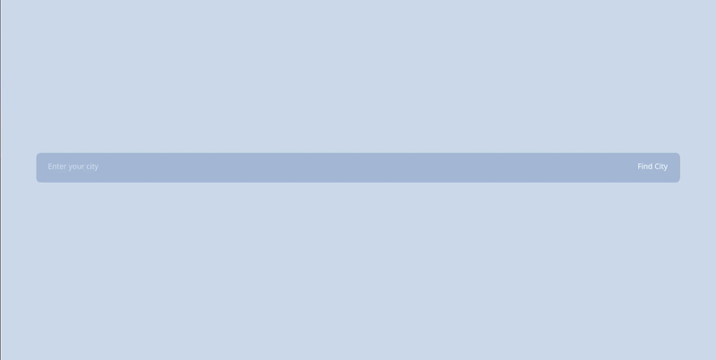

# Weather-App

The weather app website for checking weather of the city using Visual Crossing API

**Link to Project:** https://defalterxd.github.io/Weather-App/

## How It's Made 

**Tech Used:** HTML, CSS, JavaScript, Webpack

In this project I utilize the asynchronous code using 'Promises' and 'async' keyword with 'await'. The main challenge of this whole project was debugging the APIs requests and trimmed the fetched JSON for proper usage.

Then after trimming I decided use the proper Celsius converter for both temperature to display. That required for me to hold an object for both JSON version of the data in Fahrenheit and Celsius to display it on the page.

After that there was dynamic import which use promises for fetching code of modules for weather icons. That part was tedious to packaging the modules itself with 22 icons.

And the rest was easy, making styling decent and even using localStorage for re-fetching after page reload. With the custom 'loading' component when the fetching process is occurring.

## Lesson Learned:

<ul>
    <li>Using asynchronous code with 'Promise' and 'Async' function</li>
    <li>Make a converter for both temperature: Fahrenheit and Celsius</li>
    <li>Make use of the API for the fetching information itself</li>
    <li>Utilizing help tools like ESLint and Prettier</li>
    <li>Use dynamic imports for weather icons</li>
</ul>

## References: 

**Visual Crossing Weather API:** https://www.visualcrossing.com/weather-api/

**Visual Crossing Weather Icons:** https://github.com/visualcrossing/WeatherIcons
